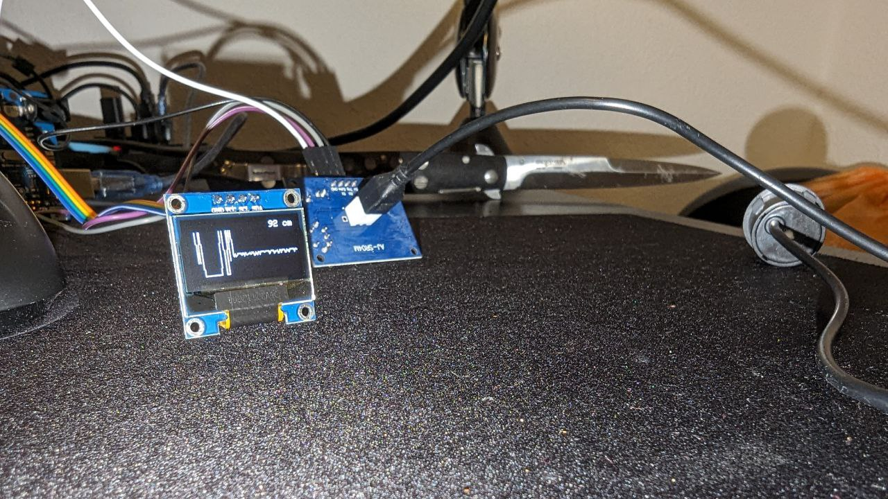
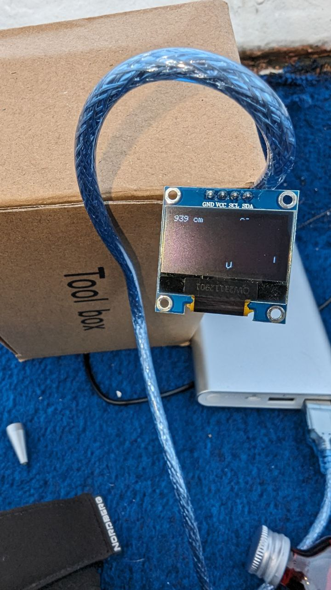

# SonarTracking
  
SonarTracking is just a working title for now.  
Experimenting with Ultrasonic sensors for underwater usage.  
Maybe we will add more sensors on the way.  
  
This project is just a way for me to learn my ways around microcontrollers and such things.  

### Tests
Example Pulse outoput:  

  
First valid check roughly 9 meters.  
The echo sounder we had on board showed similar values for this depth.  
After roughly 10-12 meters it started to get unprecise and at a depth of 18 meters or more it stopped reliably working in the first test.  
The video just shows the setup used on the boat.

<video src="resources/videos/SonarSetupBoat.mp4" width="240" height="380" controls></video>

### Circuit
Work in progress

### Products  
  
Will be updated as we go

| Image  |  Product | Currently using |
|---|---|---|
|   | [Arduino Uno R3](https://amzn.to/4as1Q4x)  | Yes |
|   | [DS18B20](https://amzn.to/4cpJy5C)  | No |
|   | [JSN-SR04T Ultrasonic](https://amzn.to/3TAsHEK)  | Yes |
|   | [OLED Parent 128 x 64 Pixel](https://amzn.to/4a7SoDt)  | Yes |
|   | [Jumper Wire](https://amzn.to/3TqtLe1)  | Yes |
